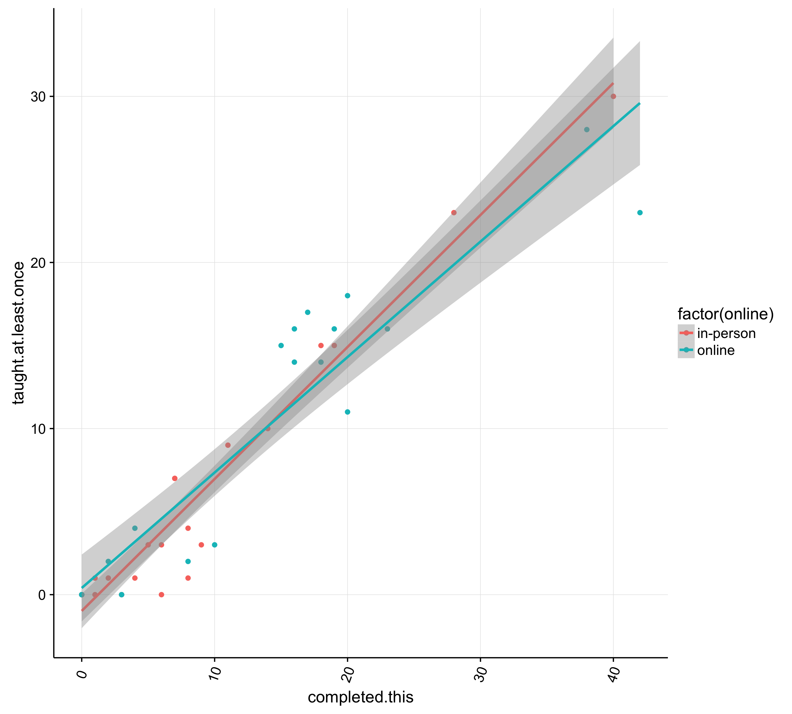

# swc_data
Repo for analyzing SWC data

# Motivation
Greg Wilson wrote two blog posts about [active SWC workshops](http://software-carpentry.org/blog/2016/02/active-workshops.html) and [instructor training](http://software-carpentry.org/blog/2016/02/correlations.html). He made some pretty graphs and asked for other plots. 

So, here is my attempt to make some other pretty plots

# Online vs In-person teaching
Here are a few plots show correlations showing how many in the newly trained instructors have taught at least one workshop.

###This first one is all the data together. 

###This one is broken down a little bit more for an indepth analysis of the effect of year

###Interpretation
It looks to me like both in person and online training work equally well if the desired outcome is that new instructors teach at least 1 workshop. 
