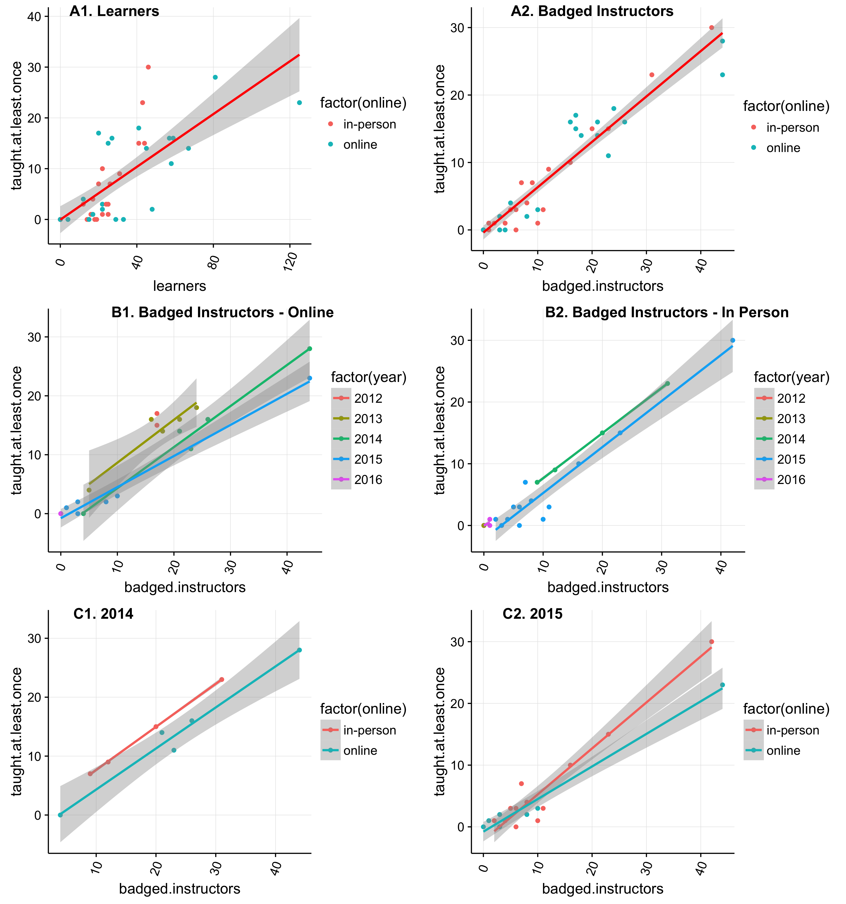

# swc_data
Repo for analyzing SWC data

# Motivation
Greg Wilson wrote two blog posts about [active SWC workshops](http://software-carpentry.org/blog/2016/02/active-workshops.html) and [instructor training](http://software-carpentry.org/blog/2016/02/correlations.html). He made some pretty graphs and asked for other plots. 

So, here is my attempt to make some pretty correlation plots using the instructor training data.

## Online vs In-person Training Correlation Plots

## How I made these. 
Check out my [R script](https://github.com/raynamharris/swc_data/blob/master/instructors.R) to see the linear model that I ran to get the R^2 and the commands used to make the plots

## Plot Description and Interpretation
### A1 & A2. Not all learners but most badged instructors will teach 
Just because we train a lot of new instructors doesn't mean that they all go on to teach a workshop. The number of learners is not a great predictor of how many will actually go on to teach a workshop (R^2 = 0.7021), but once they get their badge, they are very likely to teach (R^2 = 0.915)

### B1 & B2. With time, more people will teach a workshop
We just started the new year, so many newly badged instructors haven't had the chance to teach a workshop. When we account for year, there is a very strong correlation between number of badged instructors and those who have taught a course.  It looks like over time, more and more are teaching.   

## C1 & C2. Slightly more badged instructors from in-person training are teaching
For 2014 and 2015, it looks like a few more badged instructors from the in-person training have gone on to teach a workshop compared to those who completed online training.  Given that the attrition rate for online workshops appears to be greater (not shown), one could conclude that the in-person training is more effective at producing SWC instructors. 
